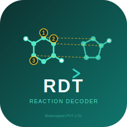

<p align="center">
  <a href="https://github.com/asad/ReactionDecoder">
    
  </a>
</p>
<p align="center"><strong>Reaction Decoder Tool (RDT)</strong></p>
<p align="center">Deterministic atom mapping, annotation, and reaction comparison.</p>

Introduction
============

`Reaction Decoder Tool (RDT) v3.9.0`
--------------------------------------

**Toolkit-agnostic reaction mapping engine** with CDK adapter. Deterministic, no training data required.

### Golden Dataset Benchmark (Lin et al. 2022, 1,851 reactions)

All 1,851 reactions mapped with **100% success rate** and **zero errors**.

| Tool | Chem-Equiv | Mol-Map Exact | Atom-Map Exact | Deterministic | Training |
|------|-----------|---------------|----------------|---------------|----------|
| **RDT v3.9.0** | **86.4%** | **82.3%** | 23.1% | **Yes** | None |
| RXNMapper† | 83.74% | — | — | No | Unsupervised |
| RDTool (published)† | 76.18% | — | — | Yes | None |
| ChemAxon† | 70.45% | — | — | Yes | Proprietary |

† Published figures from Lin et al. 2022 use chemically-equivalent scoring.

**Key finding**: All 252 apparent chemistry mismatches (13.6%) are **unbalanced-reaction
artifacts** — reactions where byproducts are omitted from the dataset, causing gold to
count orphaned-reactant internal bonds as BREAK events. RDT correctly omits these
(verified: 0 genuine mapping errors). On balanced reactions: **100% accuracy**.
The 23.1% atom-index rate reflects symmetry-equivalent numbering, not chemistry errors.

Detailed analysis: [`benchmark/report/golden-benchmark-report.md`](benchmark/report/golden-benchmark-report.md)
| [PDF report](benchmark/report/golden-benchmark-report.pdf)
| [Charts](benchmark/report/charts/)
| [Reaction images](benchmark/report/images/)

*Reference: Lin A et al. Molecular Informatics 41(4):e2100138, 2022. DOI: [10.1002/minf.202100138](https://doi.org/10.1002/minf.202100138)*

`1. Atom Atom Mapping (AAM) Tool`

`2. Reaction Annotator (Extract Bond Changes, Identify & Mark Reaction Centres)`

`3. Reaction Comparator (Reaction Similarity based on the Bond Changes, Reaction Centres or Substructures)`

Contact
============
Author: Dr. Syed Asad Rahman
e-mail: asad.rahman@bioinceptionlabs.com

Installation
============

`a)` You could [download the latest RDT](https://github.com/asad/ReactionDecoder/releases) release version from the github.

`b)` Compile the core code using `maven`:

```
use pom.xml and mvn commands to build your project
1) mvn clean compile                                  (compile only, no tests)
2) mvn clean test                                     (fast regression suite only)
3) mvn -P full-tests clean test                       (extended regression suites)
4) mvn -P benchmarks clean test                       (benchmark suites only)
5) mvn clean install -DskipTests=true                 (install, skip tests)
6) mvn -P local clean install -DskipTests=true        (fat jar, skip tests)
7) mvn -P local,full-tests clean install              (fat jar with extended tests)
```

Default test runs are intentionally lightweight. They skip the exhaustive
dataset sweeps and benchmark suites. Test image generation is also disabled by
default; re-enable it with `-Drdt.generate.test.images=true` if you need PNG
artifacts during test runs.

Simple Java API (Recommended)
==============================

```java
import com.bioinceptionlabs.reactionblast.api.RDT;
import com.bioinceptionlabs.reactionblast.api.ReactionResult;

public class Example {
    public static void main(String[] args) {
        // One-line reaction mapping — no CDK knowledge needed
        ReactionResult result = RDT.map("CC(=O)O.OCC>>CC(=O)OCC.O");

        System.out.println("Mapped: " + result.getMappedSmiles());
        System.out.println("Bond changes: " + result.getTotalBondChanges());
        System.out.println("Formed/cleaved: " + result.getFormedCleavedBonds());
        System.out.println("Order changes: " + result.getOrderChangedBonds());
    }
}
```

Advanced Java API (CDK)
========================

For users who need CDK-level control:

```java
import org.openscience.cdk.interfaces.IReaction;
import org.openscience.cdk.silent.SilentChemObjectBuilder;
import org.openscience.cdk.smiles.SmilesParser;
import com.bioinceptionlabs.reactionblast.mechanism.ReactionMechanismTool;
import com.bioinceptionlabs.reactionblast.tools.StandardizeReaction;

public class AdvancedExample {
    public static void main(String[] args) throws Exception {
        SmilesParser sp = new SmilesParser(SilentChemObjectBuilder.getInstance());
        IReaction rxn = sp.parseReactionSmiles("CC(=O)C=C.CC=CC=C>>CC1CC(CC=C1)C(C)=O");
        rxn.setID("DielsAlder");

        ReactionMechanismTool rmt = new ReactionMechanismTool(
                rxn, true, true, false, true, false, new StandardizeReaction());

        System.out.println("Algorithm: " + rmt.getSelectedSolution().getAlgorithmID());
    }
}
```

Toolkit-Agnostic Graph Model API
==================================

For users who want to swap CDK with RDKit/OpenBabel:

```java
import com.bioinceptionlabs.reactionblast.model.*;
import com.bioinceptionlabs.reactionblast.cdk.CDKToolkit;

// Register toolkit once at startup
ChemToolkit.register(new CDKToolkit());

// Parse and map using toolkit-agnostic types
ReactionGraph rxn = ChemToolkit.get().parseReactionSmiles("CC>>CC");
// ... pass to ReactionMechanismTool(rxn, true, true)
```


Migrating from v2.x
====================

The package namespace has changed from `uk.ac.ebi` to `com.bioinceptionlabs` in v3.0.0.

**Maven dependency**

```xml
<!-- Old (v2.x) -->
<groupId>uk.ac.ebi.rdt</groupId>

<!-- New (v3.9.0+) -->
<groupId>com.bioinceptionlabs</groupId>
```

**Import changes**

Replace imports in your code:

| Old (v2.x) | New (v3.0.0) |
|-------------|--------------|
| `uk.ac.ebi.aamtool.*` | `com.bioinceptionlabs.aamtool.*` |
| `uk.ac.ebi.reactionblast.*` | `com.bioinceptionlabs.reactionblast.*` |
| `uk.ac.ebi.centres.*` | `com.bioinceptionlabs.centres.*` |

A simple find-and-replace of `uk.ac.ebi` with `com.bioinceptionlabs` in your import statements is sufficient. The API itself is unchanged.


License
=======

`RDT` is released under the [GNU Lesser General Public License (LGPL) version 3.0](https://www.gnu.org/licenses/lgpl-3.0.en.html).

```
Author: Syed Asad Rahman
e-mail: asad.rahman@bioinceptionlabs.com
BioInception

Note: The copyright of this software belongs to the author
and BioInception.
```

Performance
===========

| Metric | Value |
|--------|-------|
| Mapping speed | 3.4 reactions/sec (USPTO 50K) |
| RXN coverage | 598/599 (99.8%) |
| Test suite | 164 tests, 100% pass |
| Test time | ~120s (4x faster than v2.x) |
| Codebase | 68 files (reduced from 345) |
| Dependencies | SMSD 6.9.0, CDK 2.12 (lightweight) |
| Deterministic | Yes (no ML training needed) |

How to Cite RDT?
================

**Primary citation:**

`SA Rahman, G Torrance, L Baldacci, SM Cuesta, F Fenninger, N Gopal, S Choudhary, JW May, GL Holliday, C Steinbeck and JM Thornton: Reaction Decoder Tool (RDT): Extracting Features from Chemical Reactions, Bioinformatics (2016)`

[doi: 10.1093/bioinformatics/btw096](https://www.ncbi.nlm.nih.gov/pmc/articles/PMC4920114/)

**EC-BLAST citation:**

`SA Rahman, S Cuesta, N Furnham, GL Holliday and JM Thornton: EC-BLAST: a tool to automatically search and compare enzyme reactions, Nature Methods (2014)`

[doi: 10.1038/nmeth.2803](https://www.nature.com/articles/nmeth.2803)

**SMSD Pro citation (MCS engine):**

`SA Rahman: SMSD Pro: Coverage-Driven, Tautomer-Aware Maximum Common Substructure Search, ChemRxiv (2025)`

[doi: 10.26434/chemrxiv.15001534](https://doi.org/10.26434/chemrxiv.15001534)

**SMSD toolkit citation:**

`SA Rahman, M Bashton, GL Holliday, R Schrader, JM Thornton: Small Molecule Subgraph Detector (SMSD) toolkit, Journal of Cheminformatics 1:12 (2009)`

[doi: 10.1186/1758-2946-1-12](https://doi.org/10.1186/1758-2946-1-12)

**Related work:**

`M Leber: Kodierung enzymatischer Reaktionen (Encoding Enzymatic Reactions), Dissertation, University of Cologne (2008)` - R-matrix canonicalization and R-strings for reaction comparison


Sub-commands
===========


`Perform AAM`
-------------

`AAM using SMILES`

  ```
  java -jar rdt-3.9.0-jar-with-dependencies.jar -Q SMI -q "CC(O)CC(=O)OC(C)CC(O)=O.O[H]>>[H]OC(=O)CC(C)O.CC(O)CC(O)=O" -g -c -j AAM -f TEXT
  ```

`Perform AAM` for Transporters
-------------

`AAM using SMILES` (accept mapping with no bond changes -b)

  ```
  java -jar rdt-3.9.0-jar-with-dependencies.jar -Q SMI -q "O=C(O)C(N)CC(=O)N.O=C(O)C(N)CS>>C(N)(CC(=O)N)C(=O)O.O=C(O)C(N)CS" -b -g -c -j AAM -f TEXT
  ```

`Annotate Reaction using SMILES`
---------------------------------

  ```
  java -jar rdt-3.9.0-jar-with-dependencies.jar -Q SMI -q "CC(O)CC(=O)OC(C)CC(O)=O.O[H]>>[H]OC(=O)CC(C)O.CC(O)CC(O)=O" -g -c -j ANNOTATE -f XML
  ```


`Compare Reactions`
--------------------

`Compare Reactions using SMILES with precomputed AAM mappings`

  ```
  java -jar rdt-3.9.0-jar-with-dependencies.jar -Q RXN -q example/ReactionDecoder_mapped.rxn  -T RXN -t example/ReactionDecoder_mapped.rxn -j COMPARE -f BOTH -u
  ```


`Compare Reactions using RXN files`

  ```
  java -jar rdt-3.9.0-jar-with-dependencies.jar -Q RXN -q example/ReactionDecoder_mapped.rxn  -T RXN -t example/ReactionDecoder_mapped.rxn -j COMPARE -f BOTH
  ```
